# Online Retail II: Aprendizaje de máquina para el análisis de ventas

Análisis de las ventas de un comercio electrónico británico con scikit-learn:

- **Parte 0:** obtención, limpieza, análisis exploratorio y visualización de los datos.
- **Parte 1:** clasificar a los clientes en "Normal" y "Premium".
- **Parte 2:** segmentar a los clientes con K-means y Mean Shift.
- **Parte 3:** predecir las ventas futuras.

## 1. Datos

| Característica | Valor |
| --- | --- |
| Fuente | [UCI Machine Learning Repository, ID 502](https://archive.ics.uci.edu/dataset/502/online+retail+ii) (CC BY 4.0) |
| Contenido | Ventas de una tienda en línea del Reino Unido que vende artículos de regalo; muchos de sus clientes son mayoristas |
| Periodo | 01/12/2009 – 09/12/2011 |
| Registros | 1,067,371 originales → 997,355 tras la limpieza |

Cada fila es una **línea de factura**: un producto dentro de una compra.

## 2. Estructura del repositorio

```
├── data/                  # se genera al ejecutar los scripts (no se sube)
├── scripts/
│   ├── 00_descarga_datos.py    # descarga y unión de las dos hojas del Excel
│   ├── 01_limpieza.py          # limpieza de datos
│   ├── 02_eda.py               # análisis exploratorio
│   ├── 03_visualizacion.py     # figuras del análisis exploratorio
│   ├── 04_clasificacion.py     # Parte 1
│   ├── 05_segmentacion.py      # Parte 2
│   └── 06_prediccion.py        # Parte 3
├── reports/
│   ├── *.txt                   # registro de resultados de cada script
│   └── figures/                # gráficas
├── requirements.txt
└── README.md
```

## 3. Ejecución

```
conda activate mcd
pip install -r requirements.txt
python scripts/00_descarga_datos.py
python scripts/01_limpieza.py
python scripts/02_eda.py
python scripts/03_visualizacion.py
python scripts/04_clasificacion.py
python scripts/05_segmentacion.py
python scripts/06_prediccion.py
```

El primer script tarda varios minutos porque lee el Excel; los demás tardan segundos. Cada script guarda sus resultados en `reports/`.

## 4. Parte 0.1: Obtención de datos

El Excel original tiene **dos hojas**, una por año. Al revisarlas se encontraron dos problemas:

- **Las hojas se repiten en parte.** Del 1 al 9 de diciembre de 2010, ambas hojas contienen las mismas 22,523 filas. Se eliminaron de la primera hoja antes de unirlas. Resultado: 1,044,848 filas.
- **La documentación no coincide con el archivo.** La página de UCI usa nombres de columnas distintos a los del archivo (por ejemplo, `UnitPrice` en lugar de `Price`) e indica que no hay datos faltantes, aunque sí los hay: el 22.52 % de las filas no tiene cliente y el 0.41 % no tiene descripción.

Los datos se guardan en formato Parquet, que conserva los tipos de datos y se lee mucho más rápido que Excel.

## 5. Parte 0.2: Limpieza de datos

**Objetivo:** quedarse solo con **ventas válidas**: productos reales, con cantidad y precio positivos, y que no fueron anuladas.

**Antes de limpiar se corrigieron los códigos de producto.** Algunos códigos tenían espacios sobrantes o letras en minúscula (por ejemplo, `85099b` y `85099B`), así que el mismo producto aparecía con dos códigos. Se pasaron todos a mayúsculas: el catálogo baja de 5,305 a 5,131 códigos.

| # | Criterio | Filas eliminadas | Motivo |
| --- | --- | --- | --- |
| 1 | Duplicados exactos | 11,812 | Inflarían las ventas |
| 2 | Ventas anuladas después | 6,092 | La venta se canceló completa (mismo cliente, producto, precio y cantidad) |
| 3 | Cancelaciones | 19,104 | Facturas que empiezan con `C`: no son ventas |
| 4 | Cantidad o precio ≤ 0 | 6,019 | Ajustes sin valor comercial |
| 5 | Códigos que no son productos | 4,466 | Envíos (`POST`), comisiones, ajustes manuales, vales de regalo y pruebas |

**Resultado:** 997,355 filas (se elimina el 4.55 %), con 39,264 facturas, 4,716 productos, 5,839 clientes y £19.1 millones de ingreso.

- **El criterio 2 es importante para las Partes 1 y 2.** Sin él, un cliente cuya compra se canceló seguiría pareciendo un cliente de alto valor. Detecta automáticamente los dos pedidos gigantes (80,995 y 74,215 unidades) que en el Taller 01 se excluyeron a mano.
- **Las filas sin cliente (22.74 %) se conservan**, porque son ventas reales y la predicción de ventas (Parte 3) las necesita. Las Partes 1 y 2 trabajan por cliente, así que no las usan.

El detalle de cada criterio está en [`reports/01_registro_limpieza.txt`](reports/01_registro_limpieza.txt).

## 6. Parte 0.3: Análisis exploratorio

### Distribución de las variables principales (por línea de factura)

| Variable | Mediana | Media | Máximo |
| --- | --- | --- | --- |
| Cantidad (unidades) | 4 | 10.8 | 19,152 |
| Precio unitario (£) | 2.10 | 3.33 | 1,157 |
| Ingreso (£) | 10.00 | 19.15 | 38,970 |

- **La mayoría de las compras son pequeñas, pero hay algunas enormes.** Por eso la media es mucho mayor que la mediana.
- **Las compras enormes son de mayoristas, no errores.** Por ejemplo, un cliente de Dinamarca compró 19,152 tazas a £0.10 cada una.

### Concentración: pocos clientes y productos generan la mayor parte del ingreso

| Grupo | % del ingreso que genera |
| --- | --- |
| 20 % de los clientes con más gasto | 76.7 % |
| 6 % de los productos más vendidos | 50 % |
| 22 % de los productos más vendidos | 80 % |

- El 27.6 % de los clientes compró una sola vez.
- El Reino Unido concentra el 85.5 % del ingreso.

El registro completo está en [`reports/02_registro_eda.txt`](reports/02_registro_eda.txt).

## 7. Parte 0.4: Visualización

### ¿Cómo se distribuyen la cantidad, el precio y el ingreso?

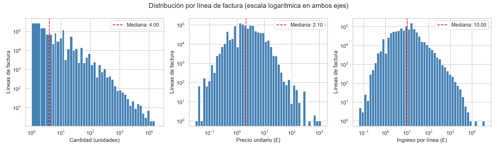

- **Las tres variables tienen muchos valores pequeños y pocos muy grandes.** Por eso se usa escala logarítmica, donde cada marca del eje multiplica el valor por 10.
- **Las cantidades tienen picos en 12 y 24**, porque los productos se venden por docenas.

### ¿Cuáles son los productos más vendidos?

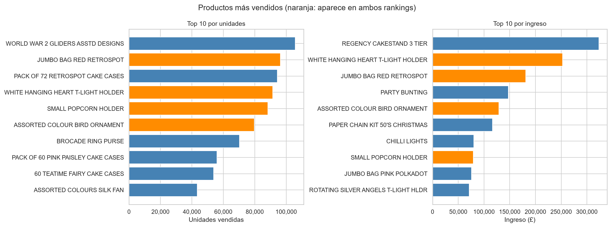

- **Más unidades no significa más ingreso.** WORLD WAR 2 GLIDERS es el primero en unidades (105,755), pero es barato y no aparece en el top por ingreso.
- **REGENCY CAKESTAND 3 TIER es el primero en ingreso** (£323 mil), con solo 25,825 unidades.
- **Cuatro productos (en naranja) están en ambos rankings**, por ejemplo WHITE HANGING HEART T-LIGHT HOLDER.

### ¿Cómo evolucionan las ventas de esos productos?

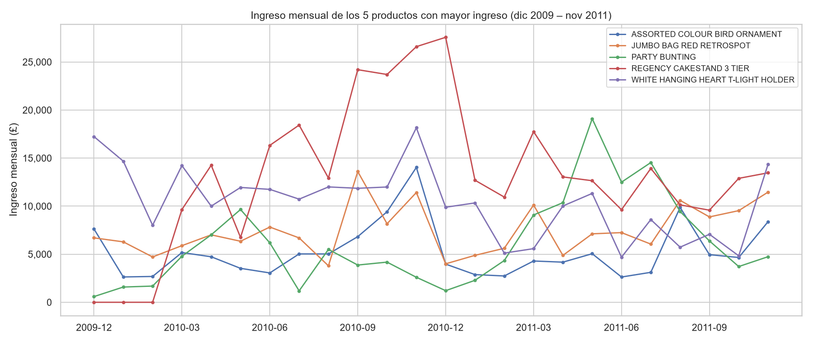

- **Cada producto tiene su propio patrón.** REGENCY CAKESTAND empezó a venderse en marzo de 2010 y aun así es el producto con más ingreso. PARTY BUNTING tiene su máximo en mayo, como producto de verano.

### ¿Hay temporadas de mayor venta?

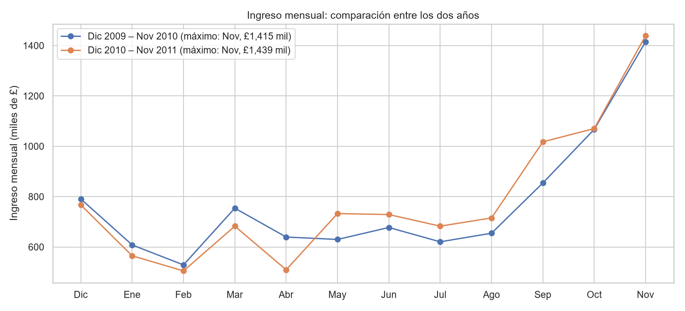

- **Sí.** En los dos años las ventas suben desde septiembre y alcanzan su máximo en noviembre: £1.4 millones, casi el triple que febrero.
- **Septiembre, octubre y noviembre suman más de un tercio de las ventas del año.** Coincide con las compras de Navidad en un negocio de regalos.
- **Con dos años de datos se confirma que el patrón se repite**, algo que el Taller 01, con un solo año, no pudo comprobar.

### ¿En qué días y horas se compra?

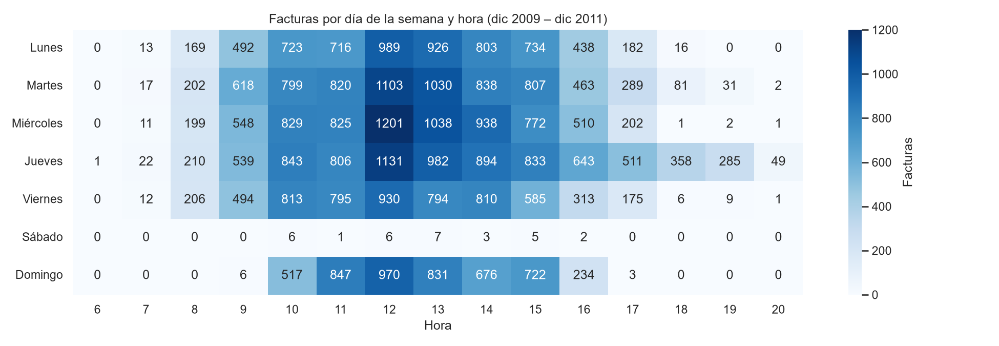

- **Las compras se concentran entre las 10 y las 15 h**, con el máximo a las 12 h.
- **El jueves es el día con más compras.** La tienda no vende los sábados.

## 8. Parte 1: Clasificación de clientes

### ¿Qué es un cliente "Premium"?

Se construyó una tabla con **una fila por cliente** (5,839 clientes) y se definió:

> **Premium = el 20 % de clientes con mayor ingreso total** (£2,864 o más).

**¿Por qué el 20 %?** Ese grupo genera el 76.7 % del ingreso: casi la regla 80/20 de Pareto. Se consideraron otras opciones, como un umbral fijo en libras, la frecuencia de compra o una combinación de ambas. Se eligió esta por ser simple y estar respaldada por los datos.

### Variables del modelo

El modelo predice si un cliente es Premium a partir de su comportamiento de compra:

| Variable | Significado |
| --- | --- |
| `frecuencia` | Número de compras (facturas) |
| `recencia` | Días desde la última compra |
| `antiguedad` | Días desde la primera compra |
| `productos_distintos` | Cuántos productos diferentes compró |
| `lineas_por_factura` | Tamaño promedio de cada compra |
| `es_uk` | Si el cliente es del Reino Unido |

**El ingreso no se usa como variable,** porque es justamente lo que define la etiqueta. Si se usara, el modelo solo aprendería "ingreso ≥ £2,864 → Premium", con un acierto casi perfecto pero sin aprender nada útil.

**Perfil típico (mediana):** un cliente Premium compró 12 veces y lo hizo por última vez hace 23 días; un cliente Normal compró 2 veces, hace 169 días.

### Modelos y cómo se evaluaron

- Se entrenaron una **regresión logística** y un **árbol de decisión**, con el 80 % de los clientes para entrenar y el 20 % para evaluar.
- **Referencia:** predecir siempre "Normal" acierta el 80 % de las veces sin aprender nada, porque el 80 % de los clientes son Normales. Por eso la exactitud sola no basta y se usan además estas métricas para la clase Premium:

| Métrica | Pregunta que responde |
| --- | --- |
| **Precisión** | De los clientes que el modelo marcó como Premium, ¿cuántos lo eran? |
| **Recall** | De los clientes Premium reales, ¿cuántos encontró el modelo? |
| **F1** | Combina precisión y recall en un solo número (de 0 a 1) |

**Optimización de hiperparámetros.** Se probaron distintas configuraciones de cada modelo con `GridSearchCV`, por ejemplo la profundidad del árbol, comparándolas solo con los datos de entrenamiento. La mejora fue mínima: el F1 pasó de 0.772 a 0.775 en la regresión y de 0.777 a 0.779 en el árbol. **La configuración inicial ya era buena;** el límite está en la información de las variables, no en el ajuste del modelo.

### Resultados

| Modelo | Exactitud | Precisión | Recall | F1 |
| --- | --- | --- | --- | --- |
| Referencia (siempre Normal) | 0.80 | — | 0.00 | 0.00 |
| Regresión logística | 0.89 | 0.68 | 0.88 | 0.77 |
| Árbol de decisión | 0.92 | 0.78 | 0.81 | 0.79 |

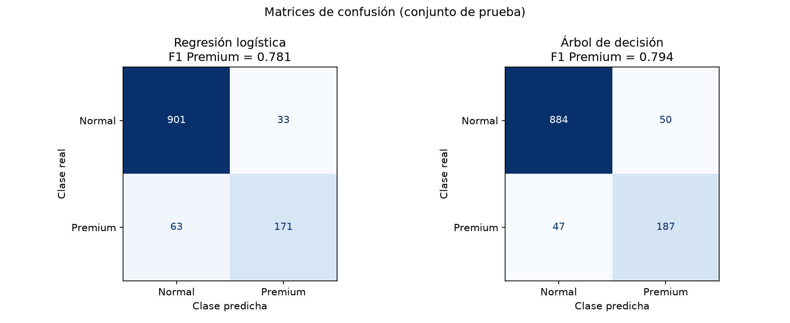

- **Ambos modelos superan claramente a la referencia:** encuentran entre el 81 % y el 88 % de los clientes Premium.
- **El árbol de decisión es el más equilibrado** (F1 = 0.79).
- **La regresión logística encuentra más Premium (205 de 234),** pero también marca como Premium a más clientes Normales (97). Conviene si lo importante es no perder a ningún cliente Premium.

### ¿Qué hace que un cliente sea Premium?

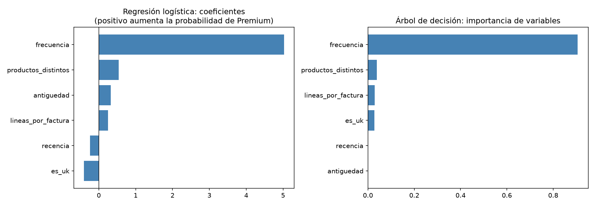

- **La frecuencia de compra es, por mucho, la variable más importante.** El árbol se resume casi en una regla: "más de 7 compras → Premium".
- **Los clientes extranjeros tienen más probabilidad de ser Premium** con la misma frecuencia, porque suelen ser mayoristas.
- **Comprar más productos distintos también aumenta la probabilidad.**

El registro completo está en [`reports/04_registro_clasificacion.txt`](reports/04_registro_clasificacion.txt).

## 9. Parte 2: Segmentación de clientes

### Variables y preparación

Se agrupó a los clientes según tres variables, conocidas como **RFM**:

- **R**ecencia: cuánto hace que compró;
- **F**recuencia: cuántas veces compró;
- **M**onto: cuánto gastó.

Antes de agrupar se hicieron dos ajustes:

1. **Logaritmo.** Unos pocos clientes gastaron cientos de miles de libras. Sin el logaritmo, formarían grupos propios y el resto quedaría en un solo grupo.
2. **Estandarización.** Pone las tres variables en la misma escala. Sin ella, la recencia, que va de 0 a 738 días, dominaría al agrupar.

**¿Cómo se mide si los grupos son buenos?** Con el **coeficiente de silueta**, que va de −1 a 1: cuanto más alto, más separados están los grupos entre sí.

### K-means

K-means necesita que se le indique cuántos grupos (k) formar. Se probaron de 2 a 8:

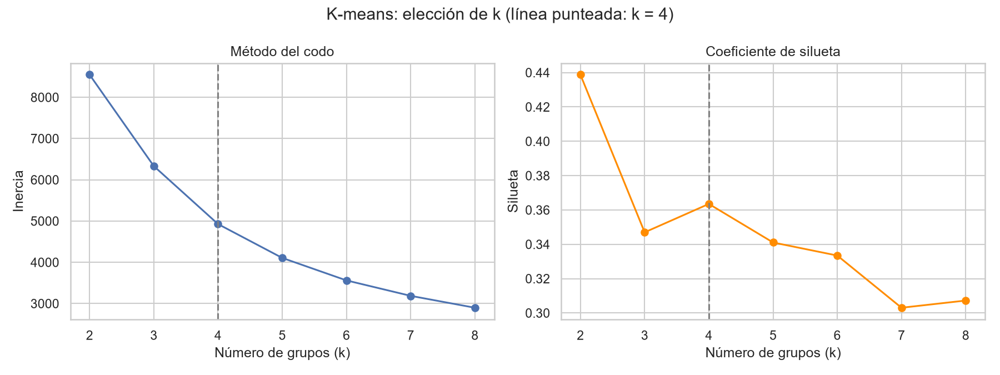

**Se eligió k = 4.**

- Con k = 2 la silueta es mayor, pero solo separa a los buenos clientes del resto.
- k = 4 es el mejor valor entre las opciones con más grupos, y da segmentos útiles:

| Grupo | % clientes | Última compra | Compras | Gasto | % del ingreso | Segmento |
| --- | --- | --- | --- | --- | --- | --- |
| 0 | 34 % | hace 400 días | 1 | £270 | 4 % | **Perdidos** |
| 1 | 21 % | hace 23 días | 3 | £717 | 6 % | **Recientes de bajo valor** |
| 2 | 25 % | hace 178 días | 5 | £1,455 | 17 % | **En riesgo** |
| 3 | 20 % | hace 16 días | 13 | £4,922 | 73 % | **Mejores clientes** |

Valores típicos (mediana) de cada grupo.

**El grupo 3 coincide en un 79 % con los clientes Premium de la Parte 1:** sin usar la etiqueta, el agrupamiento llega a los mismos clientes.

### Mean Shift

Mean Shift **decide por sí solo cuántos grupos hay**, según un parámetro de "radio" (el ancho de banda). Se probaron varios radios:

- Con radios pequeños aparecen grupos de 1 solo cliente.
- Con radios grandes todos los clientes quedan en un único grupo.
- **El mejor resultado tiene 2 grupos** (silueta 0.44):

| Grupo | % clientes | Última compra | Compras | Gasto | % del ingreso |
| --- | --- | --- | --- | --- | --- |
| 0 | 93 % | hace 119 días | 3 | £757 | 47 % |
| 1 | 7 % | hace 10 días | 26 | £10,544 | 53 % |

Mean Shift encuentra un grupo de **élite**: el 7 % de los clientes genera más de la mitad del ingreso.

### Comparación

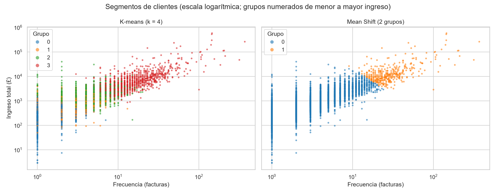

| | K-means | Mean Shift |
| --- | --- | --- |
| Número de grupos | Lo elige el analista (4) | Lo decide el algoritmo (2) |
| Tamaño de los grupos | Parecidos (20–34 %) | Muy desiguales (93 % y 7 %) |
| Qué muestra | Etapas del cliente: perdido, reciente, en riesgo, mejor | El grueso de los clientes frente a la élite |

- **Los dos métodos son coherentes:** casi toda la élite de Mean Shift (395 de 396 clientes) está dentro del grupo de mejores clientes de K-means.
- **K-means es más útil para tomar acciones,** por ejemplo una campaña para recuperar a los clientes "en riesgo". **Mean Shift muestra que la única separación natural es la de la élite.**
- **Con el mismo número de grupos (2), ambos métodos tienen la misma calidad** (silueta 0.44).

El registro completo está en [`reports/05_registro_segmentacion.txt`](reports/05_registro_segmentacion.txt).

## 10. Parte 3: Predicción de ventas

### Planteamiento

- **Qué se predice:** el ingreso total de cada día.
- **Con qué:** solo con variables de calendario (día de la semana, mes, semana del año y día del mes). Como se conocen de antemano, permiten predecir toda una temporada antes de que empiece: justo lo que necesita una tienda para preparar su inventario de Navidad.
- **Cómo se dividen los datos:** por fecha, no al azar.
  - Entrenamiento: diciembre 2009 – agosto 2011.
  - Prueba: septiembre – diciembre 2011, que incluye la temporada alta.
  - Así, el modelo nunca usa datos del futuro para aprender.
- **Modelos:**
  - **Referencia:** "lo mismo que el mismo día del año pasado".
  - **Regresión lineal.**
  - **Bosque aleatorio:** muchos árboles de decisión cuyos resultados se promedian. Se optimizó con `GridSearchCV`.

**Métricas:**

| Métrica | Significado |
| --- | --- |
| **MAE** | Error promedio por día, en libras |
| **R²** | Qué parte de la variación de las ventas explica el modelo (de 0 a 1) |
| **Error del total** | Cuánto se desvía la suma de toda la temporada |

### Resultados

| Modelo | MAE | R² | Error del total |
| --- | --- | --- | --- |
| Referencia (año pasado) | £13,674 | 0.05 | −5.7 % |
| Regresión lineal | £11,141 | 0.28 | −8.4 % |
| Bosque aleatorio | £10,035 | 0.42 | −6.9 % |

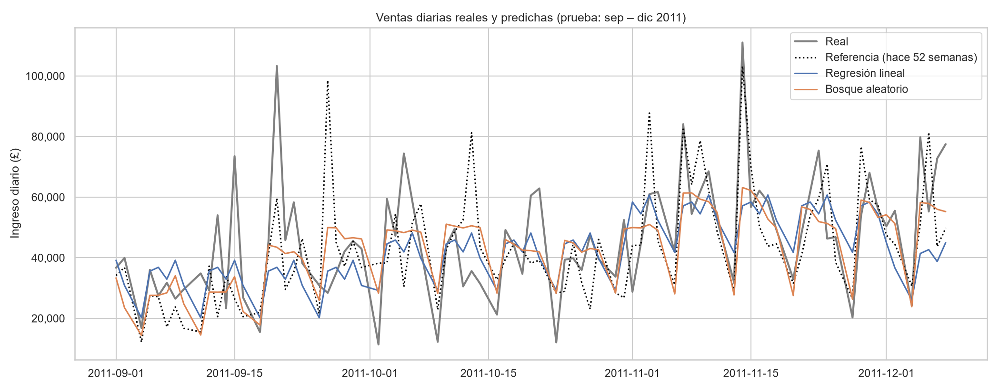

- **El bosque aleatorio es el mejor para predecir día a día:** reduce el error un 27 % frente a la referencia.
- **Ningún modelo predice los picos de días concretos,** que se deben a pedidos grandes puntuales. Por eso el R² es moderado (0.42).

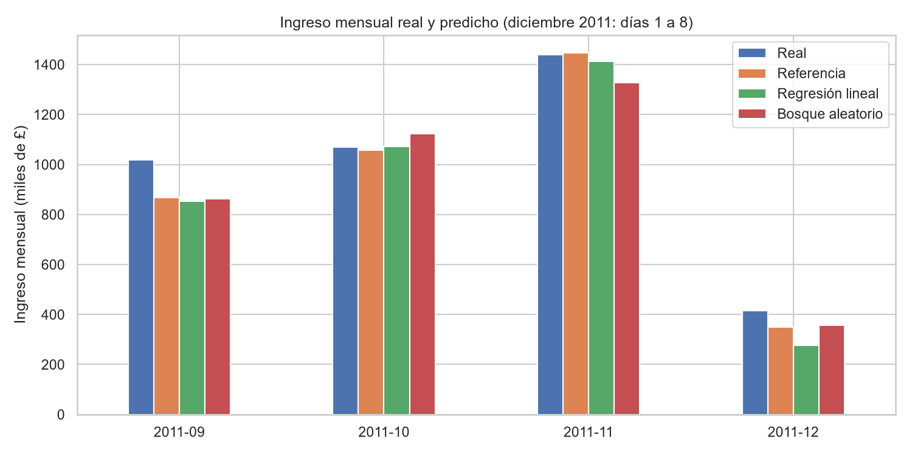

- **Para el total de la temporada, la referencia es tan buena como los modelos.** Todos subestiman el total, entre un 5.7 % y un 8.4 %.
- **La mayor parte del error está en septiembre:** las ventas de ese mes crecieron un 19 % respecto a 2010, algo que ningún método podía anticipar con un solo año de historia.
- **Octubre y noviembre se predicen bien:** la regresión lineal falla por menos del 2 %.
- **Las variables más importantes son la semana del año y el día de la semana.**

El registro completo está en [`reports/06_registro_prediccion.txt`](reports/06_registro_prediccion.txt).

## 11. Conclusiones

1. **Limpiar bien los datos es indispensable.** Filas repetidas entre hojas, ventas canceladas y códigos mal escritos habrían inflado las ventas y distorsionado los resultados de los modelos.
2. **Pocos clientes generan casi todo el ingreso.** El 20 % de los clientes aporta el 77 %, y un 7 % (la élite de Mean Shift) aporta más de la mitad.
3. **La frecuencia de compra es la clave.** Es la variable más importante para identificar a los clientes Premium, y separa a los mejores clientes en la segmentación. La clasificación y la segmentación llegan al mismo grupo de clientes por caminos distintos.
4. **Las ventas tienen una temporada muy marcada,** de septiembre a noviembre, que se repite cada año. Es lo que más ayuda a predecirlas.
5. **Siempre hay que comparar con una referencia simple.**
   - Un 92 % de acierto en la clasificación solo es bueno frente al 80 % de "siempre Normal".
   - En la predicción, el modelo mejora el error de cada día, pero no el total de la temporada.
6. **Optimizar los hiperparámetros apenas mejoró los modelos.** Para mejorarlos harían falta más o mejores datos, no un ajuste más fino.

## 12. Limitaciones

- **Clientes sin identificar.** El 22.7 % de las ventas no tiene cliente, así que las Partes 1 y 2 describen solo a los clientes identificados.
- **Solo dos años de datos.** Hay una única temporada alta para aprender, lo que impide anticipar crecimientos como el de septiembre de 2011.
- **Sin categorías de productos.** El dataset no las incluye, así que no se pudo analizar por tipo de producto.
- **Decisiones que no son únicas.** El umbral Premium (20 %) y el número de grupos (4) se justificaron con los datos, pero otros valores también serían razonables.